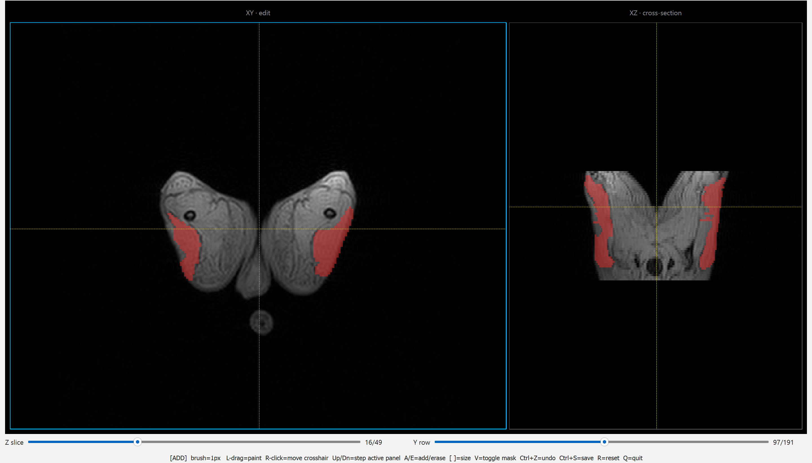

# Dog MRI Segmentation

Tools for muscle segmentation of dog MRI images, tracking muscle volume over time.

The project uses Meta's [SAM 2](https://github.com/facebookresearch/sam2) model to automatically mask a muscle group
specified by bounding boxes. This provides a starting point that makes the fine-tuning stage easier.

These tools have specifically been used on a series of multi-echo GRE2D fat/water sequences of DICOM files. These
images had a resolution of 192x192 so a fourier upscale was used to enhance the imaging, making the images clearer
and allowing for finer masks.

The anatomy in this project was identical across echoes, so the pipeline segments a single echo's 50 slices and
broadcasts that mask volume to all 7 echoes.



---

## Stages of the Project

We start with a raw DICOM series. These images are funneled into the `sam2_segmentation.ipynb` Jupyter Notebook which
runs SAM 2 to automatically segment the images (note its dependency on `biceps_pipeline.py` to load the images and
import detection helpers). These automatic segmentations are exported as `.npy` files to the `masks_out/` directory.

Automatic slicing follows these steps:

1. Loading
2. Foreground mask (Otsu)
3. Bone mask (dark + circular = femurs)
4. Crotch cut (split left/right legs)
5. Detect on one middle seed slice to get boxes
6. SAM 2 propagates
7. Combined mask

`fourier_upscale.py` is run once to upscale the images from 192x192 to 384x384. `mask_editor.py` is then used to refine
the masks, ensuring accuracy and correcting for SAM's mistakes. These masks are stored in the `edited_masks/` directory.

Finally, these masks can be converted (and were in our project) to `.mat` files using `convert_to_mat.py` which writes
to the `mat_out/` directory.

For viewing in [ITK-SNAP](https://www.itksnap.org/), the `.mat` masks in `mat_out/` can be converted to DICOM
segmentations with `mat_to_dcm.py`, which writes to the `converted_to_dcm/` directory. These can be loaded as a label
overlay on top of the original upscaled series.

---

## Files

| File                                         | Purpose                                                                                                                                                                                                                                                                       |
|----------------------------------------------|-------------------------------------------------------------------------------------------------------------------------------------------------------------------------------------------------------------------------------------------------------------------------------|
| `biceps_pipeline.py`                         | Helper library and DICOM loader that the notebook imports.                                                                                                                                                                                                                    |
| `sam2_segmentation.ipynb`                    | SAM2 video propagation: seed one good middle slice, propagate forward/backward to cover end-of-volume slices. Writes to `masks_out/`.                                                                                                                                         |
| `fourier_upscale.py`                         | One-time 2× in-plane upscale of the editor's inputs: Fourier (k-space zero-fill) upscale of the DICOMs into `DICOM_Files_upscaled/`, plus pixel-doubling the masks in place. Z axis is never touched.                                                                         |
| `mask_editor.py`                             | Interactive linked ortho-slice (XY + XZ) mask editor using PyQtGraph. Paint/erase corrections; saves to `edited_masks/` and never touches `masks_out/`. Reads the upscaled DICOMs (falls back to originals if absent).                                                        |
| `review_masks.py`                            | Read-only version of the editor. Same linked views and navigation, no painting/undo/save. Fourier-upscales display images on open to match the upscaled masks.                                                                                                                |
| `fix_slice_reversal.py`                      | One-off repair for a specific mask, which the SAM2 notebook stored in reversed slice order. Reverses the slice axis; writes a `*.prereversal.npy` backup and is safe to re-run.                                                                                               |
| `convert_to_mat.py`                          | Convert corrected `.npy` masks to MATLAB `.mat` files (drops a redundant echo dimension, was useful in our case but other projects may have varying echoes). Prompts for which series to convert (or `a` for all).                                                            |
| `mat_to_dcm.py`                              | Convert `.mat` masks into single-echo DICOM segmentations for ITK-SNAP, matching the base series geometry so they overlay as a label. Prompts for the input `.mat` directory, the base DICOM root, and which mask to convert (or `a` for all); writes to `converted_to_dcm/`. |
| `water_fat_separation/wfs_to_mask_editor.py` | Turn a CS-corrected water/fat-separation `.mat` into `..._WATER` / `..._FAT` DICOM series the editor can open, by cloning the source `0012` headers and replacing pixels. Prompts for which `.mat` in its directory to convert. May help with visibility during segmentation. |
| `download_checkpoints.py`                    | Fetch the SAM2.1 Hiera-Large checkpoint into the project root.                                                                                                                                                                                                                |
| `requirements.txt`                           | Python dependencies (install PyTorch separately).                                                                                                                                                                                                                             |

---

## Setup

```bash
pip install -r requirements.txt
# PyTorch is commented in requirements.txt because you need the build for your CUDA
pip install torch --index-url https://download.pytorch.org/whl/cu121
```

**Model checkpoints**:

**SAM 2**: `python download_checkpoints.py` fetches `sam2.1_hiera_large.pt`.

### Data layout

Place the raw DICOM series under `DICOM_Files/`:

```
DICOM_Files/
  20250102/
    GRE2D_FATWATER_NAME_0012/
    ...
```

Series folders are matched by the glob `*GRE2D_FATWATER*0012` (the magnitude
series).

---

## Usage

Full list of commands:

```bash
jupyter notebook sam2_segmentation.ipynb          # automatic segmentation (open and run in Jupyter)
python fourier_upscale.py                         # upscale images 2x (only run once)
python mask_editor.py                             # use to refine auto-generated masks
python convert_to_mat.py                          # optional to convert .npy masks to .mat
python mat_to_dcm.py                              # optional to convert .mat masks to DICOM segmentations for ITK-SNAP
python water_fat_separation/wfs_to_mask_editor.py # convert a .mat DICOM series that has been fat/water separated into DICOM images
```

## Notes

### Manual Editing

`mask_editor` copies original masks from `masks_out/` to `edited_masks/` on first run and reads the upscaled DICOM
series from `DICOM_Files_upscaled/`, falling back to originals if upscaling is skipped.

**Editor Controls**: left-drag paints, right-click moves the crosshair, `A`/`E` switches between add and erase, `[`/`]`
is used to control brush size (pixels), `C` copies the previous slice's mask onto the current one, `V` toggles the mask
overlay, `R` resets any zoom, `Ctrl+Z` undoes the previous action, `Ctrl+S` saves, and `Q` quits. Edits in either panel
(XY or XZ) mirror to all echoes.

### Optional water/fat separation:

If you place a CS-corrected water/fat separation `.mat` into `water_fat_separation/` and run

```bash
python water_fat_separation/wfs_to_mask_editor.py
```

It generates `..._WATER`/`..._FAT` DICOM series in `DICOM_Files_upscaled/` that the editor can open. All three variants
write to the same mask file.